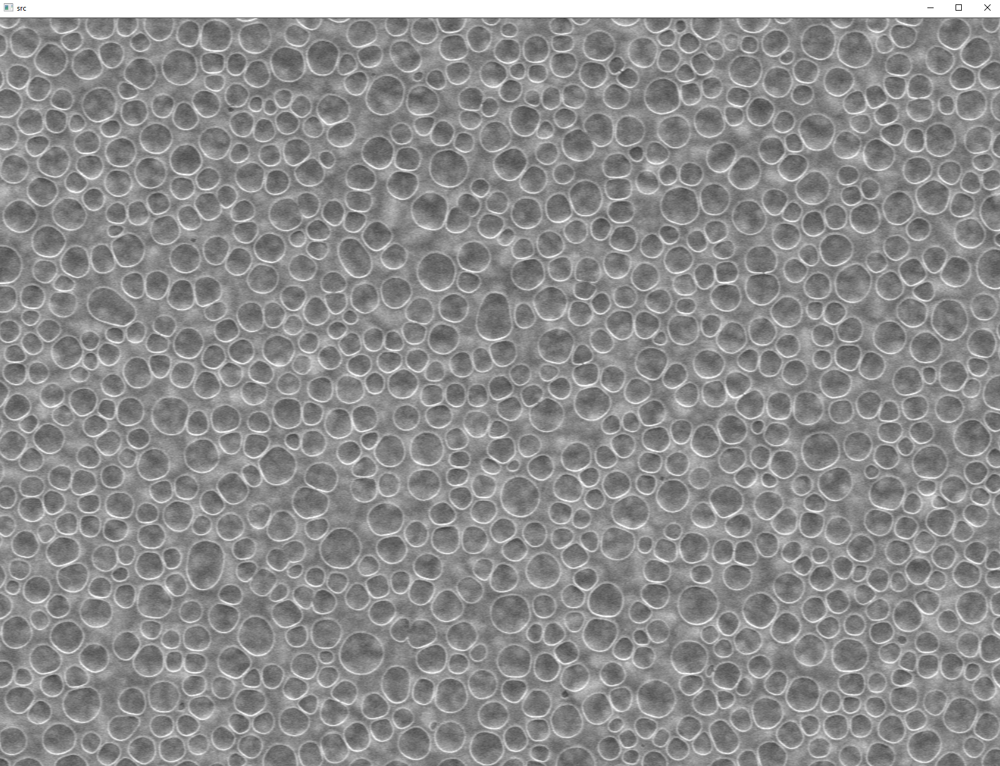
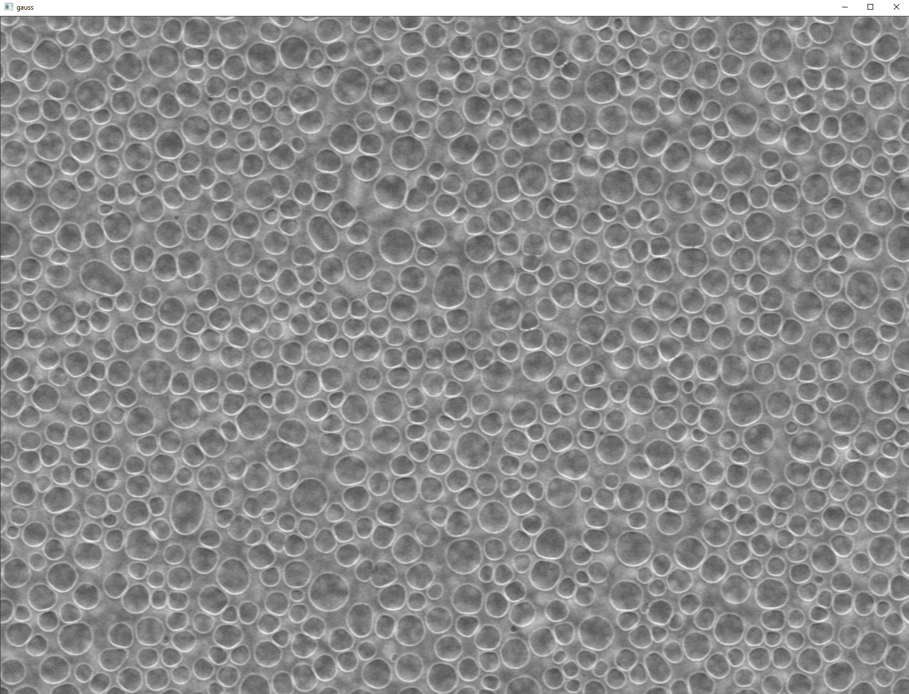
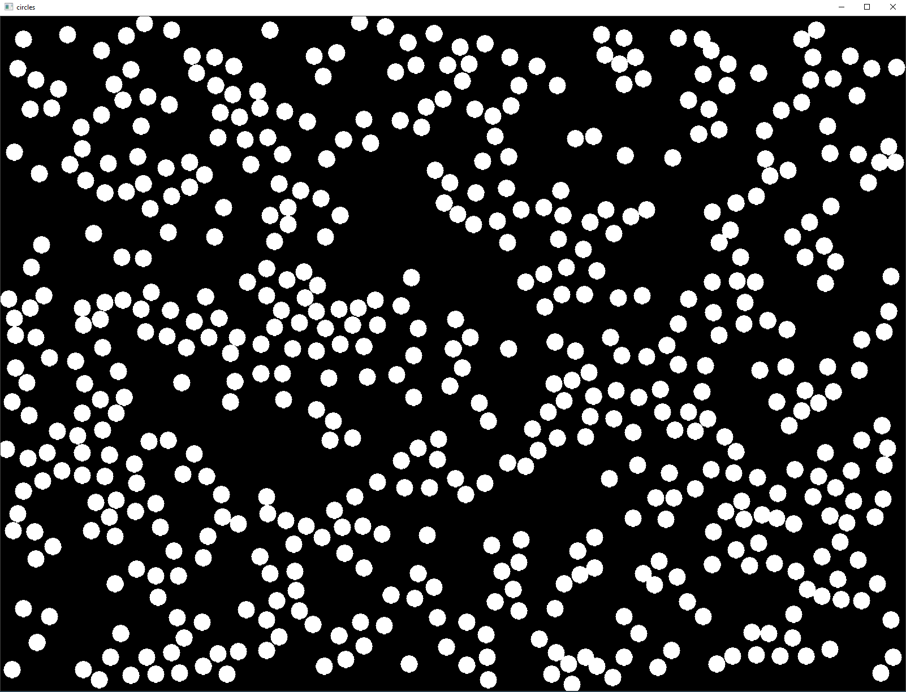
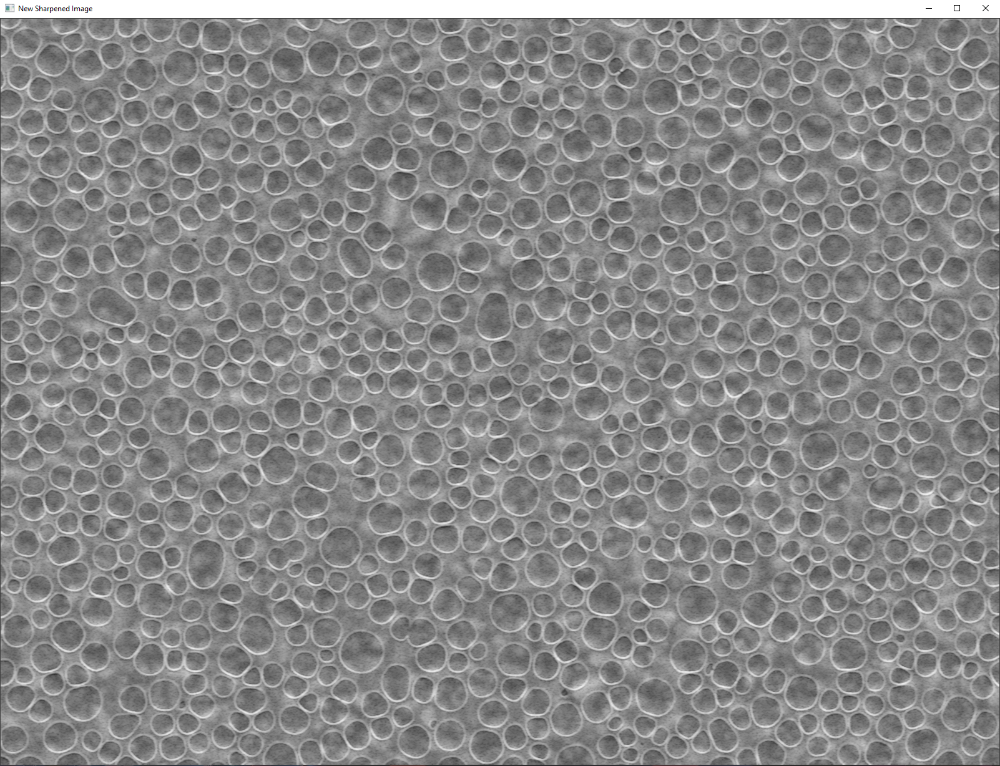
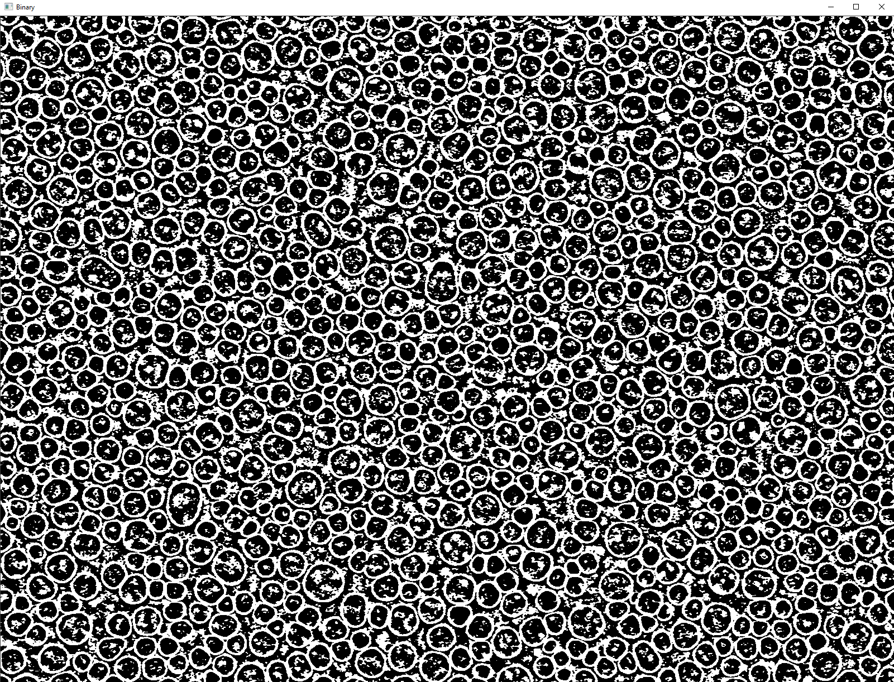
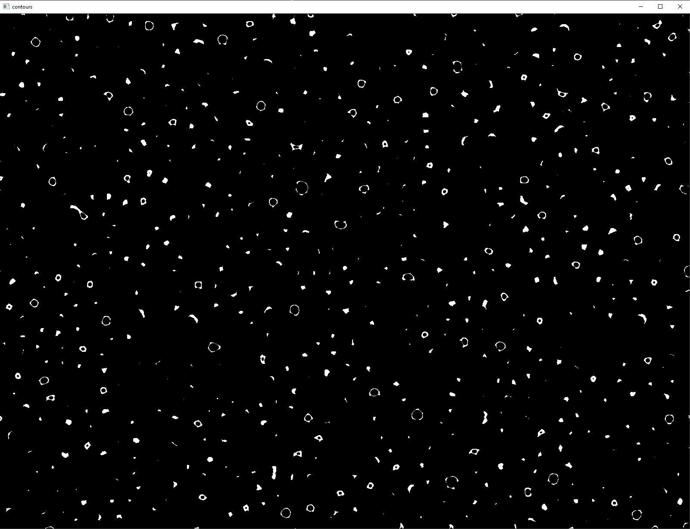
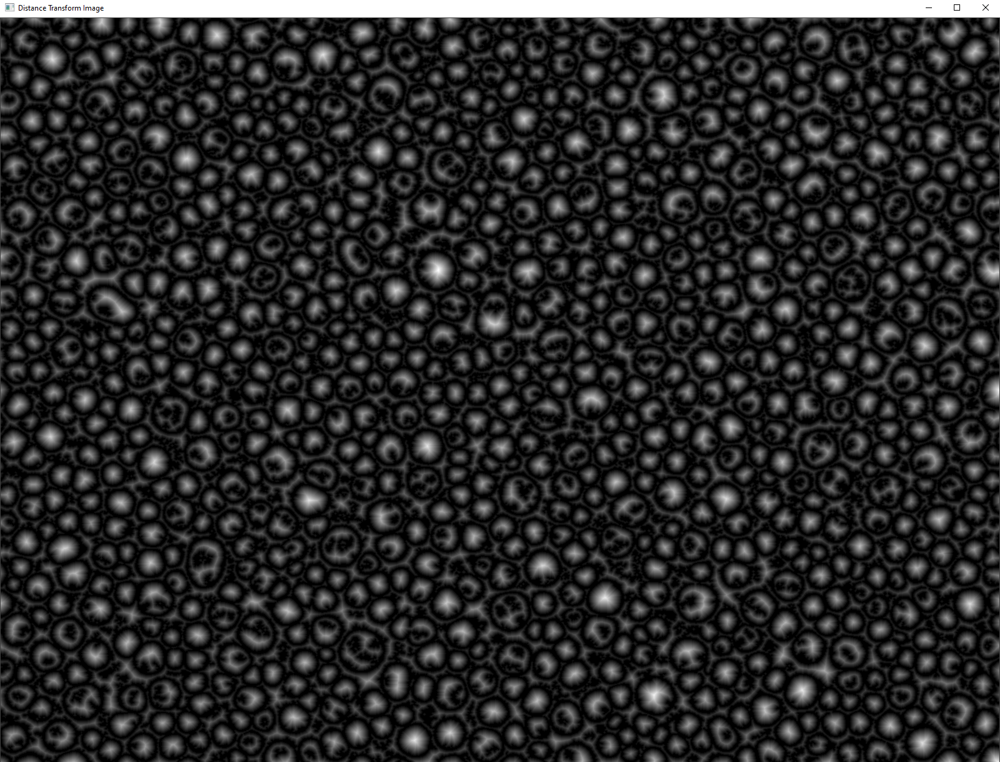

# Bubbles

## Assignment

Load an image of bubbles. Eliminate noise and binarize the image by using morphological operations and contour analysis.
Try to programmatically mark every bubble and sum the total count.

## Solution
At first, I loaded the image of bubbles and resized it to a desired size.
```cpp
cv::Mat src = cv::imread(R"(image_bubbles.jpg)", 1);
cv::resize(src, src, cv::Size(src.cols * 1.25, src.rows * 1.25), 0, 0, cv::INTER_LINEAR_EXACT);
```


Then I used Gaussian blur to remove the noise in the image with a 3x3 kernel.

```cpp
GaussianBlur(src, blur, cv::Size(3, 3), 1);
```



I was looking for a function able to find ellipses in images and I found the Hough Transform, which is able to find circles in an image. I have played with the parameters and found the best combination for my image.

```cpp
std::vector<cv::Vec3f> circles;
HoughCircles(blur2, circles, cv::HOUGH_GRADIENT, 1, 10, 100, 30, 1, 25);

for (auto& elem : circles)
{
  cv::Vec3i c = elem;
  const auto center = cv::Point(c[0], c[1]);
  circle(src2, center, 15, cv::Scalar(0, 165, 255), -1, cv::LINE_AA);
}
```

In the image below, you can see the mask of bubbles found using the Hough Transform, although there was still some space for improvement, so I tried finding some more remaining bubbles.

```cpp
threshold(src2, src2, 20, 255, cv::THRESH_BINARY);
bitwise_not(src2, src2);
```



For the remaining bubbles, I decided to use the Laplacian filter to detect edges after the image was blurred. Then I got the sharpened image by substracting the edge filter from the blurred image. After that, I used Gaussian blur to again remove some noise.

```cpp
cv::Mat imgLaplacian;
cv::Laplacian(blur, imgLaplacian, CV_8UC1);

cv::Mat imgResult = blur - imgLaplacian;
GaussianBlur(imgResult, imgResult, cv::Size(3, 3), 1);
```
The sharpened image can be seen below.



Then I used adaptive threshold to get a binary image and eroded it, so the noise in the bubbles became smaller.

```cpp
adaptiveThreshold(binary, binary, 255, cv::ADAPTIVE_THRESH_GAUSSIAN_C, cv::THRESH_BINARY, 35, 0);
cv::Mat element = cv::getStructuringElement(cv::MORPH_ELLIPSE, cv::Size(3, 3), cv::Point(1, 1));
cv::erode(binary, binary, element);
```



Next step was to draw contours, which had a specific contour area, so I would get the bubble edges only.

```cpp
std::vector<std::vector<cv::Point>> contours;
cv::findContours(binary, contours, cv::RETR_LIST, cv::CHAIN_APPROX_SIMPLE);

for (auto i = 0; i < contours.size(); ++i)
{
  if (contourArea(contours[i]) < 45)
  {
    drawContours(cont, contours, i, cv::Scalar(0), -1);
  }
}
```



I then inverted the image colors and used distance transform to highlight the middle of the bubbles, I used euclidean distance for this.

```cpp
bitwise_not(cont, cont);

cv::Mat dist;
distanceTransform(cont, dist, cv::DIST_L2, 3);
```



I used dilatation after adaptive threshold on distance transform, as the resulting contours were too thin and added this mask to the mask I got from Hough Transform to get a combined mask.

```cpp
cv::Mat element2 = cv::getStructuringElement(cv::MORPH_ELLIPSE, cv::Size(11, 11), cv::Point(1, 1));
cv::dilate(dist, dist, element2);

cv::Mat final = dist + src2;
```


I used dilatation again to connect some small lines together, counted the contours from the combined mask and have drawn them on the original image.

```cpp
cv::dilate(final, final, element);

std::vector<std::vector<cv::Point>> contours3;
cv::findContours(final, contours3, cv::RETR_LIST, cv::CHAIN_APPROX_SIMPLE);

int index = 0;

for (auto i = 0; i < contours3.size(); ++i)
{
  drawContours(src, contours3, i, cv::Scalar(0, 165, 255), -1);
  double centerX = 0.0;
  double centerY = 0.0;

  for (const auto& p : contours3[i])
  {
    centerX += p.x;
    centerY += p.y;
  }

  index++;
  cv::putText(bubbles, std::to_string(index), cv::Point(centerX / contours3[i].size(), centerY / contours3[i].size()), cv::FONT_HERSHEY_PLAIN, 1, cv::Scalar(0, 165, 255), 2);
}
```


Last step was to print the resulting count.


