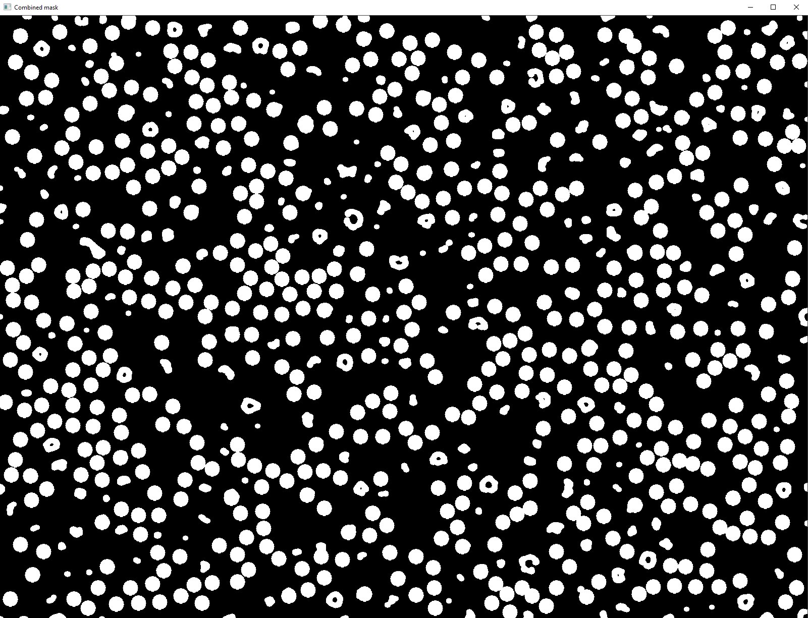
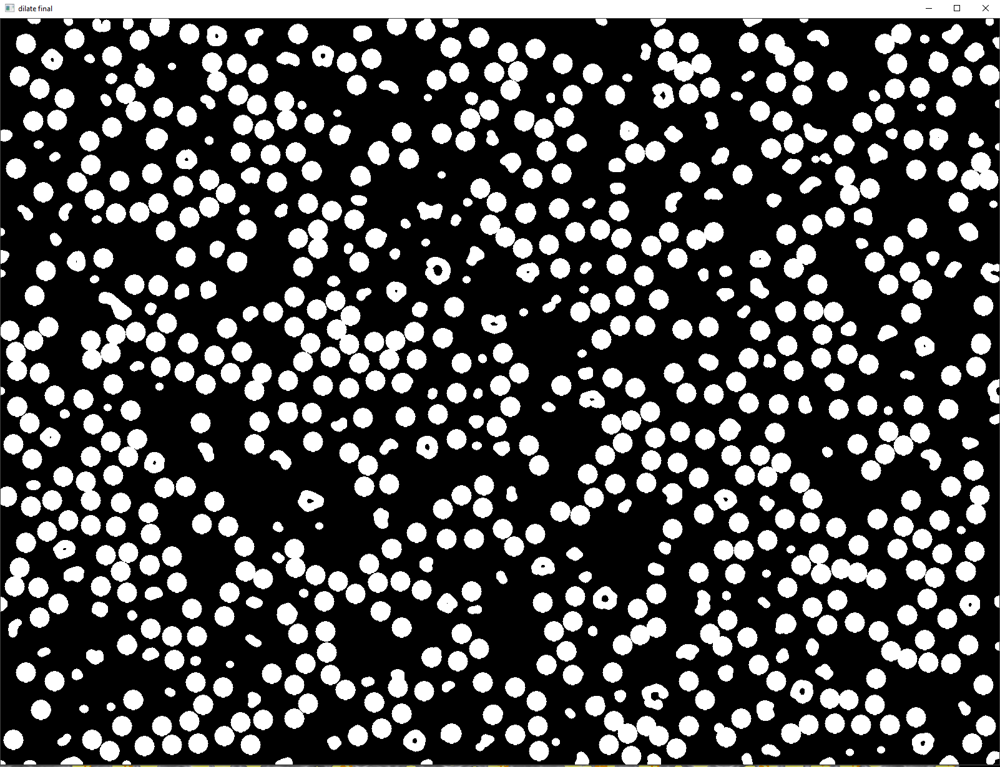
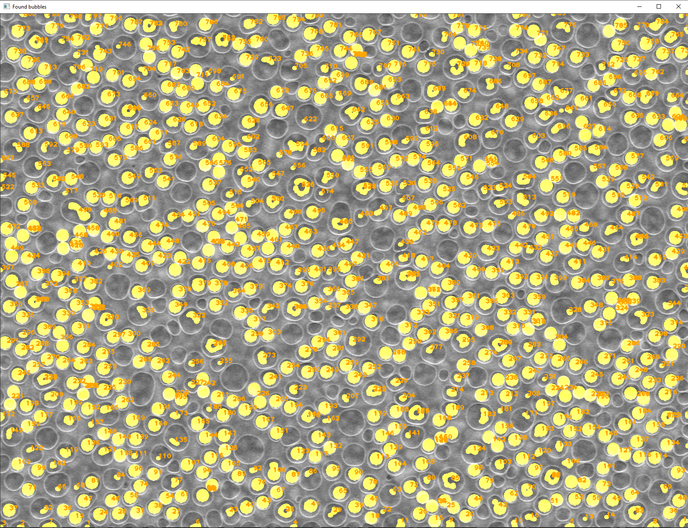
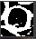
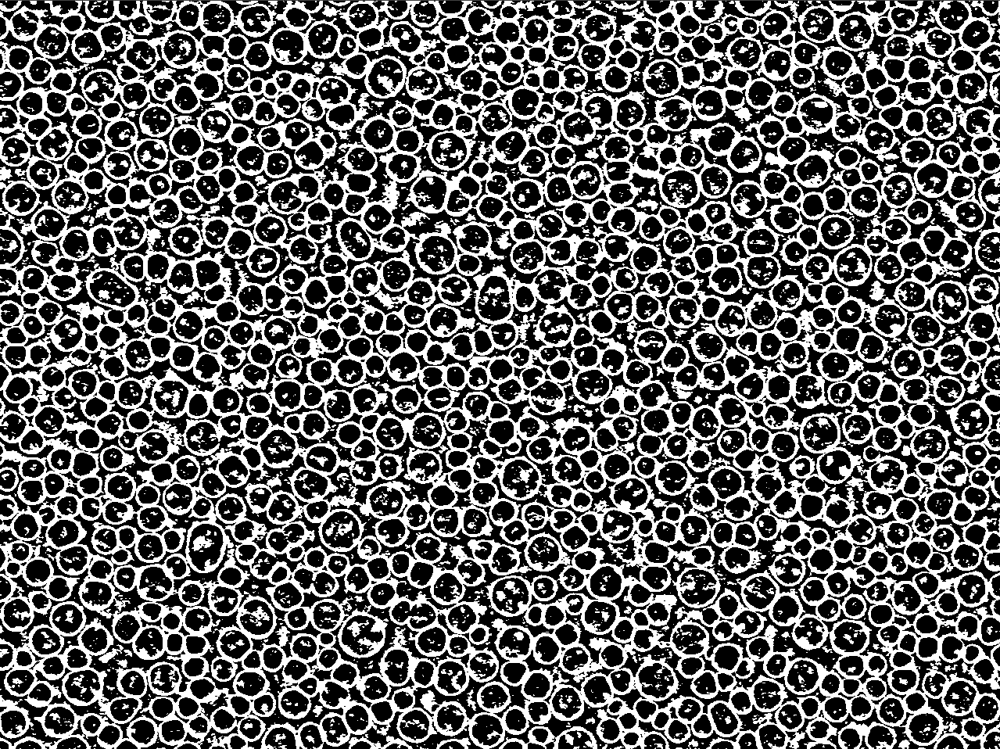
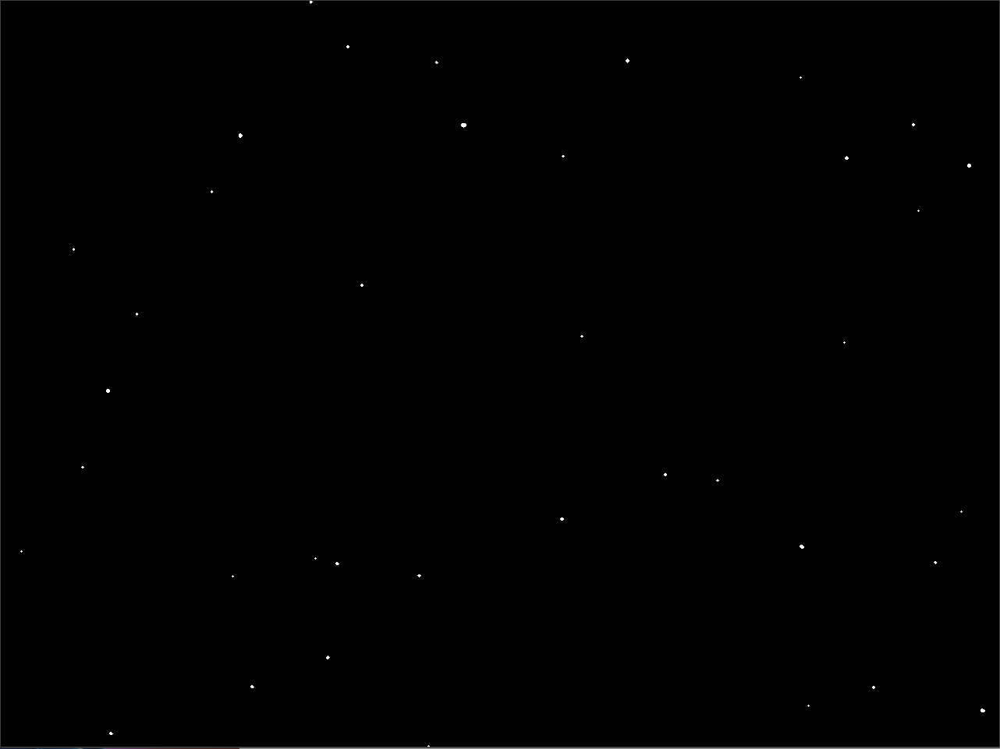
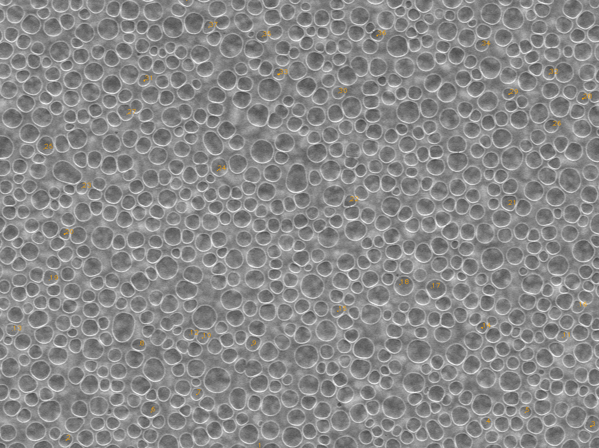

# Bubbles

## Assignment

Load an image of bubbles. Eliminate noise and binarize the image by using morphological operations and contour analysis.
Try to programmatically mark every bubble and sum the total count.

## Solution
At first, I loaded the image of bubbles and resized it to a desired size.
```cpp
cv::Mat src = cv::imread(R"(image_bubbles.jpg)", 1);
cv::resize(src, src, cv::Size(src.cols * 1.25, src.rows * 1.25), 0, 0, cv::INTER_LINEAR_EXACT);
```


Then I used Gaussian blur to remove the noise in the image with a 3x3 kernel.

```cpp
GaussianBlur(src, blur, cv::Size(3, 3), 1);
```


I was looking for a function able to find ellipses in images and I found the Hough Transform, which is able to find circles in an image. I have played with the parameters and found the best combination for my image.

```cpp
std::vector<cv::Vec3f> circles;
HoughCircles(blur2, circles, cv::HOUGH_GRADIENT, 1, 10, 100, 30, 1, 25);

for (auto& elem : circles)
{
  cv::Vec3i c = elem;
  const auto center = cv::Point(c[0], c[1]);
  circle(src2, center, 15, cv::Scalar(0, 165, 255), -1, cv::LINE_AA);
}
```

In the image below, you can see the mask of bubbles found using the Hough Transform, although there was still some space for improvement, so I tried finding some more remaining bubbles.

```cpp
threshold(src2, src2, 20, 255, cv::THRESH_BINARY);
bitwise_not(src2, src2);
```


For the remaining bubbles, I decided to use the Laplacian filter to detect edges after the image was blurred. Then I got the sharpened image by substracting the edge filter from the blurred image. After that, I used Gaussian blur to again remove some noise.

```cpp
cv::Mat imgLaplacian;
cv::Laplacian(blur, imgLaplacian, CV_8UC1);

cv::Mat imgResult = blur - imgLaplacian;
GaussianBlur(imgResult, imgResult, cv::Size(3, 3), 1);
```
The sharpened image can be seen below.


Then I used adaptive threshold to get a binary image and eroded it, so the noise in the bubbles became smaller.

```cpp
adaptiveThreshold(binary, binary, 255, cv::ADAPTIVE_THRESH_GAUSSIAN_C, cv::THRESH_BINARY, 35, 0);
cv::Mat element = cv::getStructuringElement(cv::MORPH_ELLIPSE, cv::Size(3, 3), cv::Point(1, 1));
cv::erode(binary, binary, element);
```


Next step was to draw contours, which had a specific contour area, so I would get the bubble edges only.

```cpp
std::vector<std::vector<cv::Point>> contours;
cv::findContours(binary, contours, cv::RETR_LIST, cv::CHAIN_APPROX_SIMPLE);

for (auto i = 0; i < contours.size(); ++i)
{
  if (contourArea(contours[i]) < 45)
  {
    drawContours(cont, contours, i, cv::Scalar(0), -1);
  }
}
```


I then inverted the image colors and used distance transform to highlight the middle of the bubbles, I used euclidean distance for this.

```cpp
bitwise_not(cont, cont);

cv::Mat dist;
distanceTransform(cont, dist, cv::DIST_L2, 3);
```


I used dilatation after adaptive threshold on distance transform, as the resulting contours were too thin and added this mask to the mask I got from Hough Transform to get a combined mask.

```cpp
cv::Mat element2 = cv::getStructuringElement(cv::MORPH_ELLIPSE, cv::Size(11, 11), cv::Point(1, 1));
cv::dilate(dist, dist, element2);

cv::Mat final = dist + src2;
```



I used dilatation again to connect some small lines together and counted the contours from the combined mask.

```cpp
cv::dilate(final, final, element);

std::vector<std::vector<cv::Point>> contours3;
cv::findContours(final, contours3, cv::RETR_LIST, cv::CHAIN_APPROX_SIMPLE);

int index = 0;

for (auto i = 0; i < contours3.size(); ++i)
{
  drawContours(src, contours3, i, cv::Scalar(0, 165, 255), -1);
  double centerX = 0.0;
  double centerY = 0.0;

  for (const auto& p : contours3[i])
  {
    centerX += p.x;
    centerY += p.y;
  }

  index++;
  cv::putText(bubbles, std::to_string(index), cv::Point(centerX / contours3[i].size(), centerY / contours3[i].size()), cv::FONT_HERSHEY_PLAIN, 1, cv::Scalar(0, 165, 255), 2);
}
```



After that, I have drawn them on the original image with representing numbers as seen below.



Last step was to print the resulting count.


Additionally I had to count all bubbles similar to the one provided by using custom convolution kernel.
To do this, I have applied previously mentioned methods to get a binary image of both the single bubble and all bubbles as seen below.

```cpp
	cv::Mat bubble = cv::imread(R"(bubble.png)", 1);
	cv::Mat src = cv::imread(R"(image_bubbles.jpg)", 1);
	cv::Mat original;
	src.copyTo(original);

	cvtColor(bubble, bubble, cv::COLOR_BGR2GRAY);
	cvtColor(src, src, cv::COLOR_BGR2GRAY);

	GaussianBlur(bubble, bubble, cv::Size(3, 3), 1);
	GaussianBlur(src, src, cv::Size(3, 3), 1);

	adaptiveThreshold(bubble, bubble, 255, cv::ADAPTIVE_THRESH_GAUSSIAN_C, cv::THRESH_BINARY, 35, 0);
	adaptiveThreshold(src, src, 255, cv::ADAPTIVE_THRESH_GAUSSIAN_C, cv::THRESH_BINARY, 35, 0);
```




Then, I have transformed the bubble matrix to floating points and changed the 0 points to -2 and the 255 points to 1 respectively to use it as a convolutional kernel and did the convolution.
```cpp
	bubble.convertTo(bubble, CV_32F);
	float bubbleArray[38][36];

	for (int i = 0; i < bubble.rows; ++i)
	{
		for (int j = 0; j < bubble.cols; ++j)
		{
			if (bubble.at<float>(i, j) == 0)
				bubbleArray[i][j] = -2;
			else if (bubble.at<float>(i, j) == 255)
				bubbleArray[i][j] = 1;
			else
				bubbleArray[i][j] = bubble.at<float>(i, j);
		}
	}

	cv::Mat kernel = cv::Mat(38, 36, CV_32F, bubbleArray);

	cv::filter2D(src, filtered, CV_8UC1, kernel);
```

I then called the findContours function to find contours in my mask and draw them to the source image with respective numbers. You can see the mask and the final result in the pictures below. The idea was, that whenever a bubble was similar, it would generate white pixels in the mask as a result. I also dilated the mask, so it would be more visible when drawn to the original picture.


```cpp
	std::vector<std::vector<cv::Point>> contours;
	cv::findContours(filtered, contours, cv::RETR_LIST, cv::CHAIN_APPROX_SIMPLE);

	cvtColor(filtered, filtered, cv::COLOR_GRAY2RGB);
	int index = 0;

	for (auto i = 0; i < contours.size(); ++i)
	{
		drawContours(original, contours, i, cv::Scalar(0, 165, 255), -1);

		double centerX = 0.0;
		double centerY = 0.0;

		for (const auto& p : contours[i])
		{
			centerX += p.x;
			centerY += p.y;
		}

		index++;
		cv::putText(original, std::to_string(index), cv::Point(centerX / contours[i].size(), centerY / contours[i].size()), cv::FONT_HERSHEY_PLAIN, 1, cv::Scalar(0, 165, 255), 0.5);
	}

	cv::Mat element = cv::getStructuringElement(cv::MORPH_ELLIPSE, cv::Size(3, 3), cv::Point(1, 1));
	cv::dilate(filtered, filtered, element);
```



